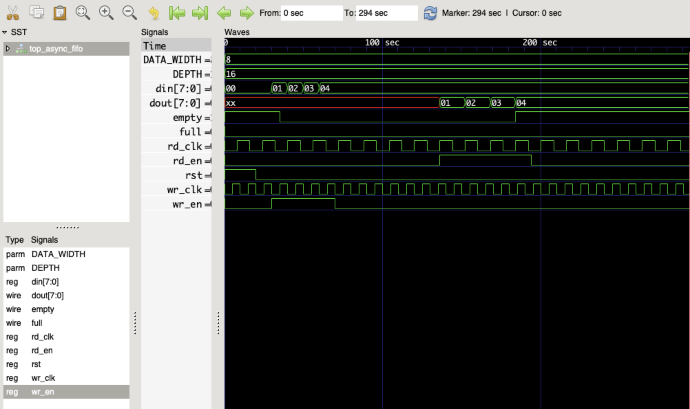

# Asynchronous-FIFO
## Overview

An Asynchronous FIFO (First-In-First-Out) buffer is a crucial component in digital design that enables efficient data transfer between two systems operating at different clock domains. It ensures smooth and reliable communication without data loss, making it ideal for applications involving clock domain crossing.

## Features
* Dual Clock Domains: Separate write and read clocks allow asynchronous operation.
* FIFO Buffering: Stores data efficiently to handle variations in data flow.
* Overflow & Underflow Handling: Prevents data loss or unnecessary reads when FIFO is full or empty.
* Configurable Parameters: Data width and FIFO depth can be easily modified.

## Working Principle
* The FIFO operates with independent write and read operations controlled by separate clock signals:

1. Write Operation:
* Data is written into the FIFO memory when wr_en is asserted.
* A write pointer (wr_ptr) tracks the next available memory location.
*The full flag is set when all memory locations are occupied.
2. Read Operation:
* Data is read from the FIFO memory when rd_en is asserted.
* A read pointer (rd_ptr) keeps track of the next available data.
* The empty flag is set when there is no data left to read.
3. Synchronization:
* Gray-coded pointers ensure safe transfer between asynchronous clock domains.
* The reset (rst) signal initializes the FIFO pointers to prevent corruption at startup.

## Applications:
* Clock domain crossing in FPGA and ASIC designs.
* Data buffering in high-speed communication protocols.
* Bridging different clock rates in microcontroller-based systems.
* Audio and video streaming where different processing units operate at independent speeds.

## Output Waveform using GTKWave

